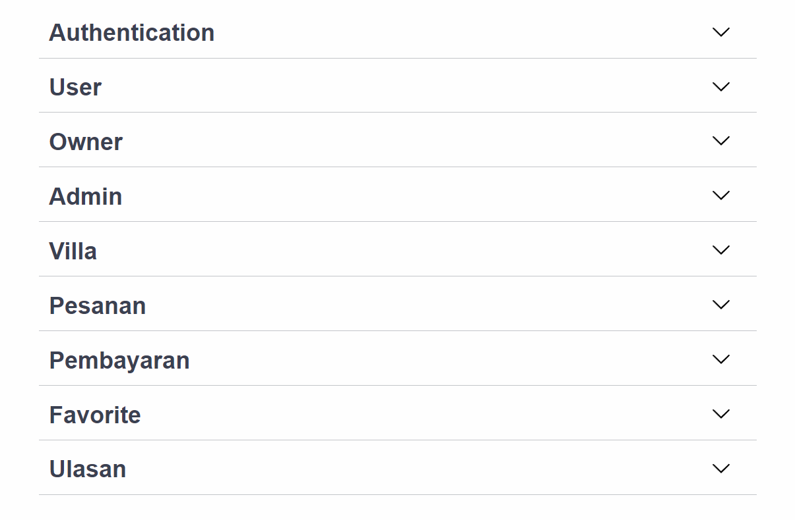
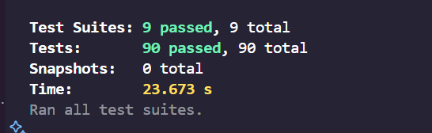

# Backend VillaPlace

[](https://github.com/Villa-Place/Backend_VillaPlace/actions/workflows/main.yml)

VillaPlace Backend adalah layanan server-side yang menyediakan API untuk mendukung aplikasi VillaPlace, sebuah platform persewaan villa yang memungkinkan pengguna untuk mencari, menyewa, dan memberikan ulasan pada villa. Aplikasi Backend Villa Place ini dibangun menggunakan **Express.js**, **TypeScript**, **JWT**, **JEST** dan **MongoDB** dengan **Mongoose** sebagai ODM.

## Link Website

Aplikasi backend VillaPlace dapat diakses melalui link berikut:  
**[https://backend-villaplace.vercel.app](https://backend-villaplace.vercel.app)**

## Prasyarat

Pastikan Anda telah menginstal hal berikut:
- [Node.js](https://nodejs.org/) (v14 atau lebih baru)
- [MongoDB](https://www.mongodb.com/) (jalankan lokal atau gunakan MongoDB Atlas)

## Instalasi

1. Clone repository ini ke direktori lokal Anda.

    ```bash
    git clone https://github.com/username/villaplace-backend.git
    cd villaplace-backend
    ```

2. Install dependencies.

    ```bash
    npm install
    ```

3. Buat file `.env` di root folder proyek berdasarkan file `.env.example`.

    ```bash
    cp .env.example .env
    ```

4. Isi variabel lingkungan di `.env` sesuai konfigurasi Anda, terutama `MONGO_URI` untuk koneksi ke MongoDB.

    ```
    MONGO_URI=mongodb://localhost:27017/villaplace
    PORT=3000
    JWT_SECRET=your_jwt_secret_key
    ```

## Jalankan Aplikasi

Setelah konfigurasi selesai, Anda bisa menjalankan aplikasi menggunakan nodemon dengan perintah berikut:

```bash
npm run dev
```

Atau untuk build dan run menggunakan TypeScript:

```bash
npm run build
npm start
```


Ini akan menjalankan server di http://localhost:3000.

## End Point API

API Backend VillaPlace menyediakan berbagai endpoint untuk mendukung operasional aplikasi. Berikut adalah daftar endpoint utamanya:



## Unit Testing

Proyek ini menggunakan Jest untuk pengujian unit dan integrasi. Screenshot hasil pengujian unit:




